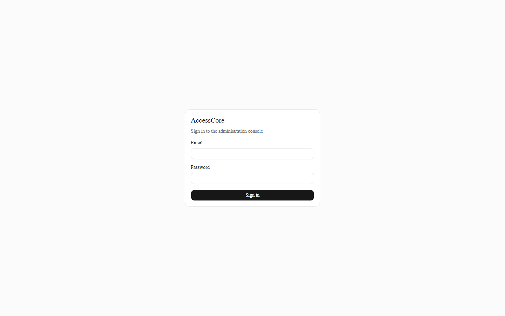
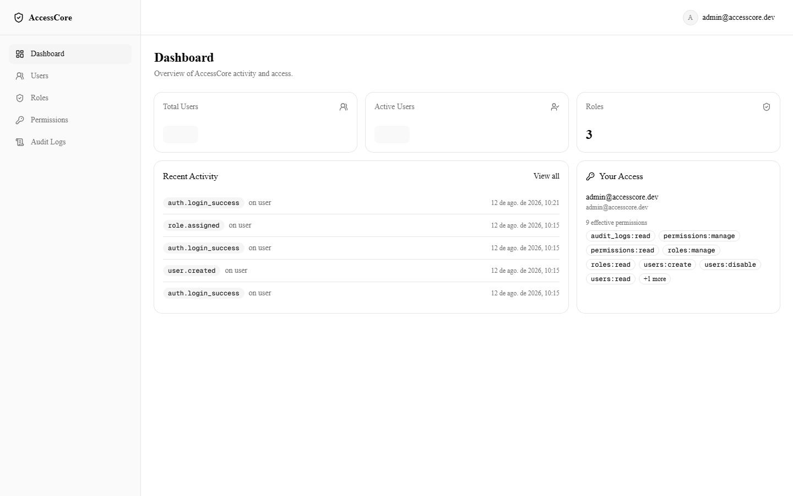
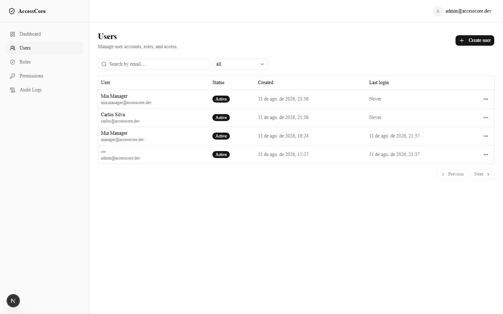
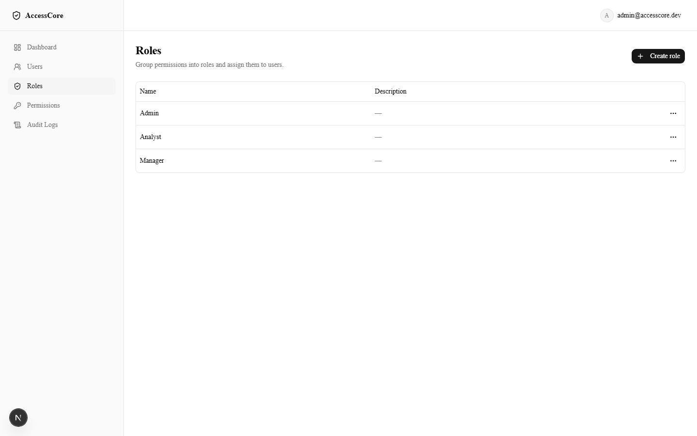
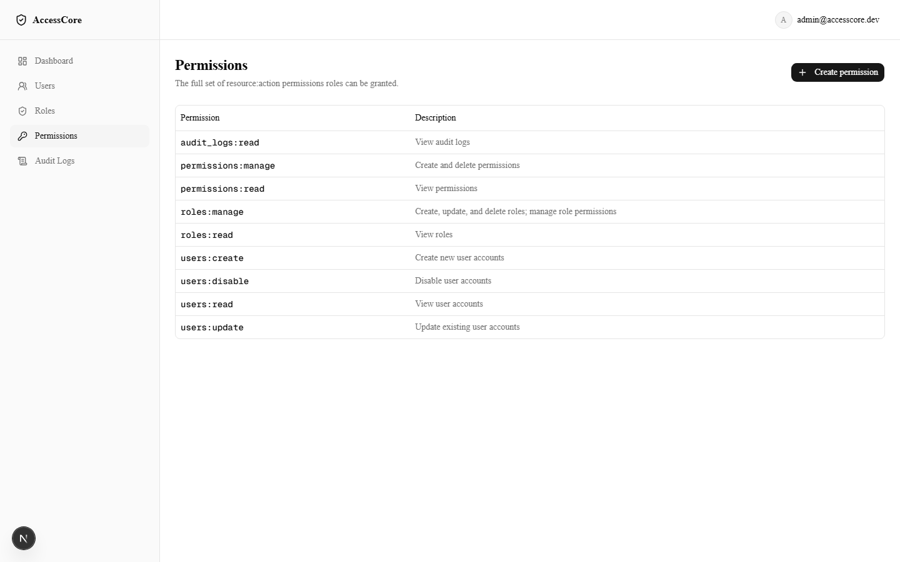
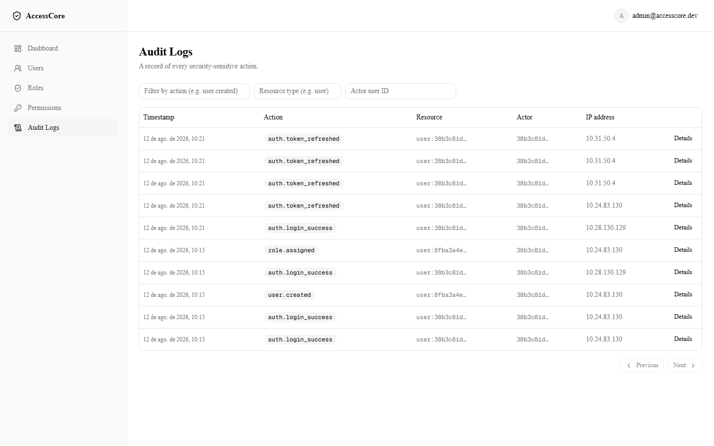
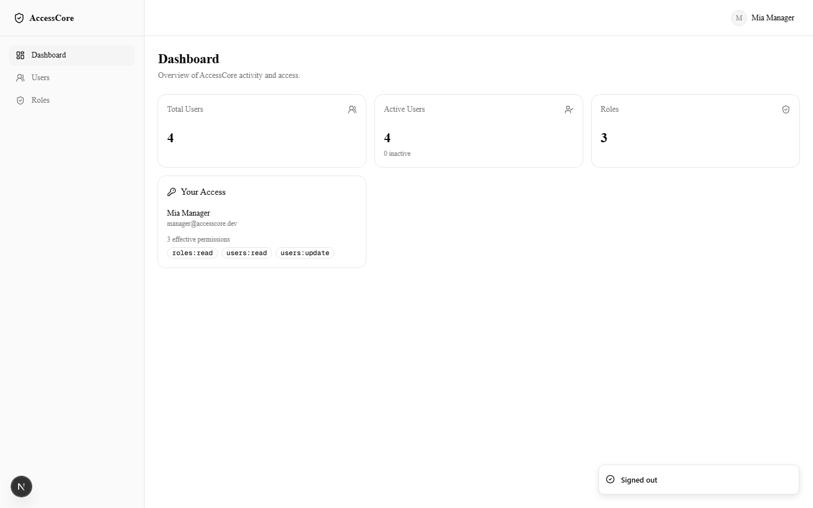
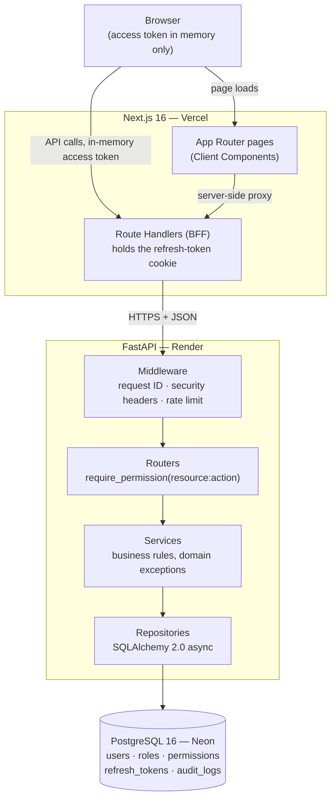
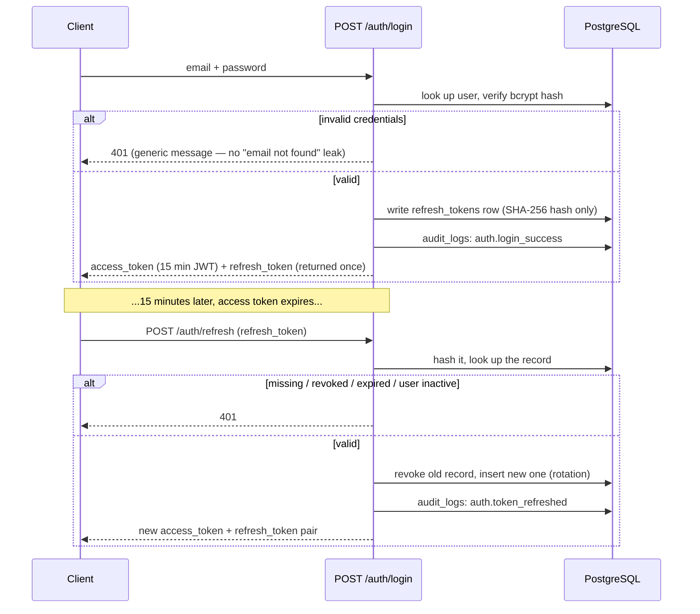
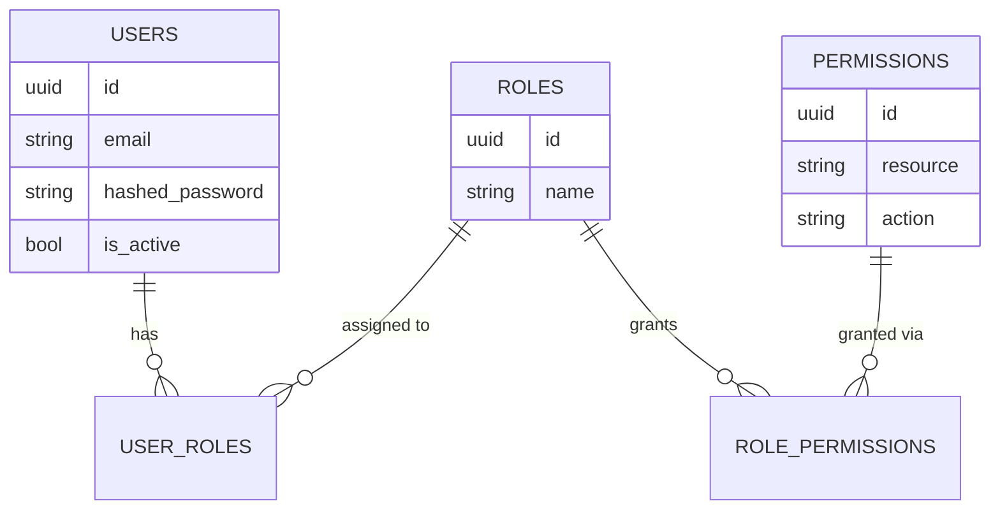

# AccessCore

[](https://github.com/lucafurtado/accesscore/actions/workflows/ci.yml)
[](LICENSE)
[](backend/pyproject.toml)
[](frontend/tsconfig.json)

**An Identity & Access Management (IAM) backend and admin console** — the kind of internal system every company with more than a handful of employees eventually needs: who can log in, what they're allowed to do, and a tamper-evident record of what they actually did.

Built solo, end to end: API, database, frontend, CI, and deployment. This is a portfolio project, but it is engineered like production software — the areas where IAM systems tend to fail (token handling, permission boundaries, audit integrity) are treated as first-class design problems, not afterthoughts.

## Table of Contents

- [Live Demo](#live-demo)
- [Screenshots](#screenshots)
- [The Problem](#the-problem)
- [Features](#features)
- [System Design](#system-design)
- [Authentication Flow](#authentication-flow)
- [RBAC Model](#rbac-model)
- [Database Schema](#database-schema)
- [API Overview](#api-overview)
- [Security Decisions](#security-decisions)
- [Testing Strategy](#testing-strategy)
- [CI/CD](#cicd)
- [Deployment](#deployment)
- [Engineering Decisions & Trade-offs](#engineering-decisions--trade-offs)
- [Project Structure](#project-structure)
- [Local Development](#local-development)
- [Lessons Learned](#lessons-learned)
- [Limitations](#limitations)
- [Future Improvements](#future-improvements)

## Live Demo

- **App:** _deploying — see [Deployment](#deployment)_
- **API:** _deploying_
- **API docs:** `<api-url>/docs`

Seeded demo accounts (this is a portfolio instance, not a real user directory):

| Role | Email | Password | Can do |
|---|---|---|---|
| Admin | `admin@accesscore.dev` | `AdminPass123!` | Everything |
| Manager | `manager@accesscore.dev` | `ManagerPass123!` | Read users/roles, update users only |

Log in as the Manager account to see the UI hide actions that account isn't permitted to perform. The restriction isn't cosmetic: calling the same endpoints directly with a Manager token is rejected by the API too, independent of what the UI shows.

## Screenshots

| | |
|---|---|
|  **Login** |  **Dashboard (Admin)** |
|  **User management** |  **Roles** |
|  **Permissions** |  **Audit logs** |

**Permission-restricted view.** Same application, logged in as the Manager account (`roles:read`, `users:read`, `users:update` only). The sidebar itself shrinks to what the account is actually allowed to do:



## The Problem

Most side projects skip access control or fake it with a single `is_admin` boolean. That works until it doesn't: someone needs a role that's "mostly admin, but can't touch billing," or an auditor asks "who disabled this account, and when," and there's no good answer.

AccessCore is a from-scratch implementation of the pattern most real systems converge on: roles composed of granular `resource:action` permissions, resolved from the database on every request (not baked into a token that can outlive a revoked grant), with every security-relevant action written to an immutable audit trail. It's scoped as a single-tenant admin console — the goal was to get the access-control primitives right, not to build a SaaS product around them.

## Features

- **Authentication** — JWT access tokens (15 min) plus single-use, rotating refresh tokens. The refresh token is delivered as an httpOnly cookie that frontend JavaScript never touches.
- **RBAC** — permissions are resolved from the database on every request. Revoke a role and it takes effect on the user's *very next* request, even if their access token has nine minutes left on it.
- **User management** — create, update, activate/deactivate, assign/remove roles. Self-disable and self-role-assignment are blocked as deliberate privilege-escalation guards, not just permission checks.
- **Audit logging** — every login, logout, token refresh, password change, and user/role/permission change is recorded with actor, action, resource, IP, user agent, and a sanitized context payload. The table is append-only at the database level, enforced by a trigger — not just by application convention.
- **Rate limiting** — login and refresh endpoints are throttled per client.
- **Security headers, structured logging, and request IDs** on every response.
- **API-first** — OpenAPI docs generated automatically by FastAPI.

## System Design



**Router → Service → Repository is the rule everywhere.** No route touches a database session directly; no service writes a raw query. Permission checks and audit writes both live at the service layer as explicit calls — nothing is inferred from generic request inspection, which keeps the security-relevant logic easy to find and easy to test in isolation.

## Authentication Flow



The raw refresh token value exists in exactly one place outside the client: the response that issues it. Everywhere else — including the database — only its SHA-256 hash is stored. Reusing an already-rotated token fails the same way an unrecognized one does, so a replayed old token can't be distinguished from a forged one by an attacker.

`PUT /auth/change-password` re-verifies the current password, then revokes every refresh token belonging to that user — a password change forces re-login on every device, not just the one that changed it.

Every login attempt, successful or not, is written to the audit log. A failed login's audit record carries the attempted email but no actor ID, since there's no authenticated identity to attach it to.

## RBAC Model



A permission is never a single stored string — it's a `(resource, action)` pair, composed as `f"{resource}:{action}"` only when read. Every protected route declares the permission it needs via a `require_permission("...")` dependency, which re-resolves the caller's effective permission set from the database **on every request**:

```python
async def get_user_effective_permissions(self, user: User) -> set[str]:
    # joins user_roles -> roles -> role_permissions -> permissions
    ...
```

Permissions are deliberately **not** embedded in the JWT. The access token only proves *who* the caller is; *what* they can do is always looked up fresh. This is verified directly by an integration test that revokes a permission mid-session and confirms the very next call with the same still-valid token is denied.

Two operations are blocked even for a user who otherwise holds the relevant `*:manage` / `*:disable` permission, because they're a distinct escalation/lockout risk rather than an ordinary authorization check:
- assigning a role to **yourself**
- disabling **your own** account

## Database Schema

```
users             id, email (unique), hashed_password, full_name,
                  is_active, created_at, updated_at, last_login_at

refresh_tokens    id, user_id → users, token_hash (unique), expires_at,
                  revoked, created_at, user_agent, ip_address

roles             id, name (unique), description, created_at, updated_at

permissions       id, resource, action (unique together), description,
                  created_at

role_permissions  role_id → roles, permission_id → permissions

user_roles        user_id → users, role_id → roles

audit_logs        id, actor_user_id → users (nullable, SET NULL on delete),
                  action, resource_type, resource_id, ip_address,
                  user_agent, context (JSONB), created_at
                  — append-only, enforced by a database trigger
```

All primary keys are UUIDs. `role_permissions` and `user_roles` are plain association tables (composite primary key, no ORM identity of their own). List endpoints (`/users`, `/audit-logs`) use cursor/keyset pagination — ordered by `(created_at, id)` descending — instead of `OFFSET`, so results stay stable under concurrent inserts and an indefinitely-growing audit table doesn't pay an increasing scan cost per page.

## API Overview

Base path: `/api/v1`. Full interactive reference at `/docs` (Swagger UI) or `/redoc`.

| Method | Path | Required permission | Notes |
|---|---|---|---|
| POST | `/auth/login` | — (rate-limited) | Issues access + refresh token pair |
| POST | `/auth/refresh` | — (rate-limited) | Rotates the refresh token |
| POST | `/auth/logout` | authenticated | Revokes the given refresh token |
| PUT | `/auth/change-password` | authenticated | Revokes all sessions for the user |
| GET | `/users` | `users:read` | Cursor-paginated, filter by `is_active`/`q` |
| GET | `/users/stats` | `users:read` | Total / active counts |
| GET | `/users/me` | authenticated | Current user's profile |
| GET | `/users/me/permissions` | authenticated | Current user's effective permissions |
| POST | `/users` | `users:create` | Admin sets the initial password directly |
| GET | `/users/{id}` | `users:read` | |
| PUT | `/users/{id}` | `users:update` | Cannot change `is_active` — see [Engineering Decisions](#engineering-decisions--trade-offs) |
| POST | `/users/{id}/disable` | `users:disable` | Blocked for self |
| POST | `/users/{id}/reactivate` | `users:disable` | |
| GET | `/users/{id}/permissions` | `users:read` | Effective permissions for any user |
| GET | `/users/{id}/roles` | `roles:read` | |
| POST | `/users/{id}/roles` | `roles:manage` | Blocked for self-assignment |
| DELETE | `/users/{id}/roles/{role_id}` | `roles:manage` | |
| GET / POST | `/roles` | `roles:read` / `roles:manage` | |
| GET / PUT / DELETE | `/roles/{id}` | `roles:read` / `roles:manage` | |
| GET / POST | `/roles/{id}/permissions` | `roles:read` / `roles:manage` | |
| DELETE | `/roles/{id}/permissions/{permission_id}` | `roles:manage` | |
| GET / POST | `/permissions` | `permissions:read` / `permissions:manage` | |
| GET | `/audit-logs` | `audit_logs:read` | Cursor-paginated, filterable by actor/action/resource/date range |

## Security Decisions

- **Passwords** are hashed with bcrypt and never returned in any API response — enforced by tests that assert `hashed_password` never appears in a response body.
- **Refresh tokens** are opaque random values (`secrets.token_urlsafe(32)`); only a SHA-256 hash is persisted, and the raw value is delivered as an httpOnly cookie that never reaches frontend JavaScript — it can't be exfiltrated via an XSS payload reading `document.cookie` or `localStorage`.
- **Authorization is always server-side.** The frontend's permission checks are UX only — they hide buttons a user isn't allowed to use. The API re-checks every mutating request against live database state regardless of what the UI shows; verified by calling restricted endpoints directly with a Manager token in [`test_rbac_authorization.py`](backend/tests/integration/api/test_rbac_authorization.py).
- **Audit logs are append-only at the database level.** A Postgres `BEFORE UPDATE OR DELETE` trigger rejects any mutation on `audit_logs` outright — this guarantee holds even against a hypothetical application bug, since it isn't just "the repository has no `update()` method." A test confirms the trigger itself rejects a direct `UPDATE`.
- **Audit records never contain secrets.** Every write goes through one `AuditService.record()` call site with a typed, primitives-only `context` payload — there's no code path for a raw password, hash, refresh token, or JWT to land in a log row. An acceptance test exercises every audited action and asserts none of those values appear anywhere in the resulting records.
- **401 vs. 403 is a strict contract:** 401 means "I don't know who you are" (missing/expired/invalid token, inactive account); 403 means "I know who you are, and the answer is no." Login failures return the same generic message and status regardless of whether the email exists, preventing account enumeration.
- **Rate limiting** on `/auth/login` and `/auth/refresh` (in-memory, per-client) targets the surface that actually matters for brute-force/credential-stuffing, rather than a blanket global limiter.
- **Security headers** (`X-Content-Type-Options`, `X-Frame-Options`, `Referrer-Policy`, `Strict-Transport-Security`) on every response; production error responses never leak stack traces (`DEBUG=false`), while `/docs` can still be exposed independently via `ENABLE_API_DOCS`.
- **CORS** is locked to the deployed frontend origin in production — no wildcard.

## Testing Strategy

```bash
cd backend && pytest --cov=app --cov-report=term-missing   # 198 tests, real Postgres, no mocked DB
cd frontend && npm test                                    # token-refresh + permission-gating logic
```

- **Backend: 198 tests across 25 files**, unit and integration, run against a real PostgreSQL instance rather than SQLite or a mocked session — the append-only trigger, cascade behavior, and cursor pagination all depend on real Postgres semantics that a lighter-weight substitute wouldn't exercise. CI enforces an 80% coverage floor; a run that drops below it fails.
- **Frontend: targeted, not exhaustive.** Full end-to-end UI coverage wasn't the goal — the security-relevant logic was: the shared in-flight promise that collapses concurrent 401s into a single refresh call, and `PermissionGate`'s render/hide behavior per permission set.
- **What's deliberately tested at the integration level, not just unit:** permission revocation taking effect mid-session, the audit trigger rejecting direct SQL mutation, and every audited action's context payload being free of secrets.

## CI/CD

GitHub Actions runs on every push and pull request against `main`:

- **backend-ci** — ruff, `black --check`, mypy, then pytest against a real Postgres service container with the coverage gate enforced.
- **frontend-ci** — eslint, `tsc --noEmit`, unit tests, then a production build.

Both jobs must pass before a change is considered mergeable. A migration step (`alembic upgrade head`) runs as an explicit pre-deploy step on Render, never automatically on container boot — see [Deployment](#deployment) for why.

## Deployment

Architecture: **Vercel** (frontend) + **Render** (API, Docker) + **Neon** (Postgres) — three providers with genuinely free, permanent tiers, no credit card required, verified against each one's current official pricing documentation before being chosen. Full step-by-step setup, including the exact Render dashboard fields and the Neon connection-string rewrite required for the async driver, is in [`DEPLOYMENT.md`](DEPLOYMENT.md).

Migrations run as an explicit pre-deploy command rather than on container boot, so a redeploy can never race two containers' migrations against each other.

**Known trade-off:** Render's free plan sleeps the API after 15 minutes of inactivity; the first request after that takes roughly 30–60 seconds to cold-start. Acceptable for a portfolio demo; not acceptable for a real production SLA.

**Current expected monthly cost: $0.**

## Engineering Decisions & Trade-offs

**Modular monolith over microservices.** Single developer, a realistic timeline, and no scaling problem that justified the operational cost of splitting services prematurely. Module boundaries — a router/service/repository set per domain — are explicit enough that any of them could be extracted into its own service later without rewriting the domain logic inside it.

**Permissions resolved live from the database, never embedded in the JWT.** This costs one extra query per protected request. In exchange, revoking a permission or role takes effect on the very next request — even against a still-valid 15-minute access token — rather than waiting for that token to expire. For an access-control system, that trade favors correctness.

**Refresh tokens in PostgreSQL, not Redis.** A `revoked` flag plus an expiry check on the existing `refresh_tokens` table is sufficient at this scale, and it avoids introducing a second source of truth for session state.

**In-memory rate limiting instead of Redis.** The target deployment is a single Render instance — Redis would add a service, a connection, and a failure mode to manage for a guarantee (state shared across processes) that a single instance doesn't need. A sliding-window counter keyed by client IP, held in process memory, covers the actual threat model (login/refresh brute-forcing) at zero infrastructure cost. The trade-off — state resets on redeploy, and this wouldn't be correct across multiple instances — is the right thing to revisit if this ever needed horizontal scaling, not before.

**`is_active` has its own dedicated endpoints, not a field on `PUT /users/{id}`.** Deactivating an account is a distinct, more consequential action than editing a name — giving it its own `users:disable` permission (separate from `users:update`) means a role can be granted one without the other, and the general update endpoint can't be used to quietly flip account status.

**HS256 JWT, not RS256.** Token issuance and verification both happen inside the same trusted backend process. Asymmetric signing earns its complexity when external parties need to verify tokens independently without holding a shared secret — that doesn't apply here.

**Access token in memory, refresh token in an httpOnly cookie via a BFF.** The browser never has JS-readable access to the refresh token, the credential that matters most if XSS ever occurs. The access token lives in a JS variable and is gone on tab close or reload, which caps the blast radius of a hypothetical XSS compromise at its 15-minute lifetime.

## Project Structure

```
accesscore/
├── backend/
│   ├── app/
│   │   ├── api/v1/routes/     # thin controllers: validate input, call a service
│   │   ├── core/               # config, security, pagination, rate limiting
│   │   ├── middleware/         # request ID, security headers
│   │   ├── models/              # SQLAlchemy ORM models
│   │   ├── repositories/       # query layer, one AsyncSession per request
│   │   ├── schemas/             # Pydantic request/response models
│   │   └── services/            # business rules, domain exceptions, audit writes
│   ├── migrations/              # Alembic
│   └── tests/                   # unit/ + integration/, real Postgres
├── frontend/
│   ├── app/                     # Next.js App Router pages + BFF route handlers
│   ├── components/              # UI components, incl. PermissionGate
│   └── lib/                     # API client, session store, token refresh
├── docs/screenshots/
├── docker-compose.yml            # full local stack: backend + db + frontend
├── render.yaml                   # Render Blueprint (best-effort; DEPLOYMENT.md is authoritative)
└── DEPLOYMENT.md
```

## Local Development

```bash
git clone https://github.com/lucafurtado/accesscore
cd accesscore
cp .env.example .env
cp backend/.env.example backend/.env   # set JWT_SECRET_KEY to a random 32+ char string
docker compose up
```

- Frontend: http://localhost:3000
- API: http://localhost:8000
- API docs (enabled by default outside production): http://localhost:8000/docs

## Lessons Learned

A few specific issues that came up during this build, kept here because the fix generalizes beyond this project:

- **Shared test state through `ASGITransport`.** Every backend test goes through `httpx.ASGITransport`, which is in-process and gives every request the same fake client IP. The module-level rate limiter didn't know that, so unrelated tests could eventually collide and start returning 429 instead of the status they expected. Fixed by resetting the limiter's state in the `client` fixture before each test — a reminder that in-process test transports can leak shared state in ways a real network client wouldn't.
- **Next.js route types don't exist on a fresh checkout.** `tsc --noEmit` depends on auto-generated types (`LayoutProps`, etc.) that Next.js writes to `.next/types/` during `next dev` or `next build`. Locally, a prior dev-server run masked this; a genuinely fresh CI checkout had nothing and failed with `Cannot find name 'LayoutProps'`. Fixed by adding an explicit `next typegen` step before type-checking in CI, and verified by simulating a truly clean checkout locally (deleting both `node_modules` and `.next`) before trusting the fix.
- **`asyncpg`'s SSL query parameter isn't `libpq`'s.** Neon's dashboard gives you a connection string with `sslmode=require`, which is the standard `libpq` spelling. SQLAlchemy's async driver (`asyncpg`) expects `ssl=require` instead — a silent-until-runtime mismatch that only shows up as a connection failure, not a clear error about the parameter name.
- **`AsyncEngine.connect` can't be monkeypatched directly** — it's a read-only attribute. Simulating a database-down health check required swapping the entire `engine` object in the module namespace for a fake with its own `.connect()`, rather than patching the method in place.

## Limitations

- No email verification or password-reset flow — accounts are provisioned directly by an admin.
- No multi-factor authentication.
- Render's free tier cold-starts after idling (see [Deployment](#deployment)) — not representative of real production latency.
- The audit log table has no retention or partitioning policy yet; fine at demo scale, would need addressing before real production volume.
- Single-tenant — there is no organization/workspace boundary.

## Future Improvements

- MFA (TOTP) and login-anomaly detection
- Email invitations for new users, replacing admin-set initial passwords
- Multi-tenancy (organizations)
- SSO (SAML/OIDC), API keys, webhooks
- Audit log table partitioning by `created_at` for long-term retention at scale

## License

[MIT](LICENSE)
